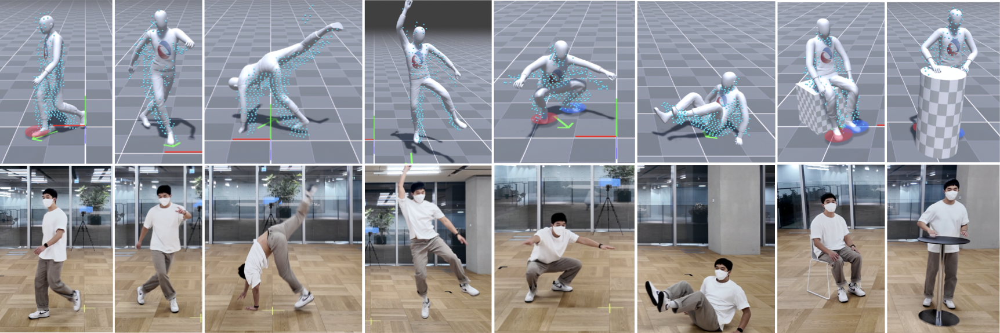

# ELMO and MOVIN Dataset & Code

#####  
 [Deok-Kyeong Jang*](https://dk-jang.github.io), [Dongseok Yang*†](https://linkedin.com/in/dongseok-yang-868045203), [Deok-Yun Jang*](https://linkedin.com/in/deok-yun-jang-a2851b161), [Byeoli Choi*](https://linkedin.com/in/byeol2ya), [Donghoon Shin](https://linkedin.com/in/donghoon-shin-376899117), [Sung-Hee Lee](https://lava.kaist.ac.kr/?page_id=41)

 
#### 
[Project Page](https://movin3d.github.io/ELMO_SIGASIA2024/) | [ArXiv]() | [Paper]() | [Demo video]()

     

Official dataset and evaluation code of 
- **ELMO: Enhanced Real-time LiDAR Motion Capture through Upsampling**, ACM Transactions on Graphics (Proc. SIGGRAPH ASIA), 2024
- **MOVIN: Real-time Motion Capture using a Single LiDAR**, Computer Graphics Forum (Proc. Pacific Graphics), 2023

 

 All Dataset and code will be released soon 👷🚧⚒️ 

## License
This project is only for research or education purposes, and not freely available for commercial use or redistribution. 
The dataset is available only under the terms of the [Attribution-NonCommercial 4.0 International](https://creativecommons.org/licenses/by-nc/4.0/legalcode) (CC BY-NC 4.0) license.
