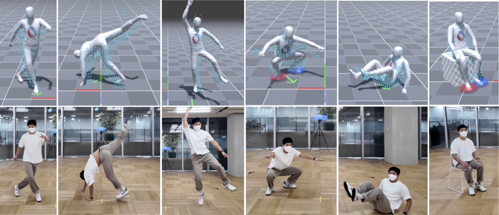
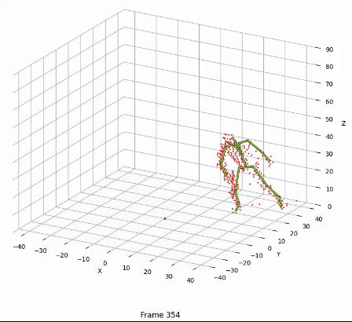

# ELMO and MOVIN Datasets & Evaluation Code

#####  <p align="center"> [Deok-Kyeong Jang*](https://dk-jang.github.io), [Dongseok Yang*](https://linkedin.com/in/dongseok-yang-868045203), [Deok-Yun Jang*](https://linkedin.com/in/deok-yun-jang-a2851b161), [Byeoli Choi*](https://linkedin.com/in/byeol2ya), [Donghoon Shin](https://linkedin.com/in/donghoon-shin-376899117), [Sung-Hee Lee](https://lava.kaist.ac.kr/?page_id=41)</p>
 
#### <p align="center">[Project Page](https://movin3d.github.io/ELMO_SIGASIA2024/) | [ArXiv](https://arxiv.org/abs/2410.06963) | [Paper](assets/ELMO_2024_Final.pdf) | [Demo video](https://youtu.be/m58sP5k4aIM)</p>

<p align="center">
    
</p>

The repo includes download instructions for the datasets and evaluation code used in following papers.
- **ELMO: Enhanced Real-time LiDAR Motion Capture through Upsampling**, ACM Transactions on Graphics (Proc. SIGGRAPH ASIA), 2024
- **MOVIN: Real-time Motion Capture using a Single LiDAR**, Computer Graphics Forum (Proc. Pacific Graphics), 2023

<!-- <br>
<p align="center"> All Dataset and code will be released soon 👷🚧⚒️ </p> -->

## Requirements
- Python 3.8+
- numpy
- scipy
- pandas
- h5py
- matplotlib

## Installation
Clone this repository and create environment:

```bash
git clone https://github.com/MOVIN3D/ELMO_SIGASIA2024.git
cd ELMO_SIGASIA2024
conda create -n elmo python=3.9
conda activate elmo
```
Install the other dependencies:
```bash
pip install -r requirements.txt 
```

## ELMO and MOVIN Datasets
We construct the dataset, a high-quality, temporal-spatial synchronized single **LiDAR-Motion Capture** dataset. 
- **ELMO dataset**: 20 subjects (12 males / 8 females). 17 subjects for train and 3 subjects for test.
- **MOVIN dataset**: 10 subjects (4 males / 6 females)). 8 subjects for train and 2 subjects for test.

### Download datasets
To download the [ELMO dataset](https://www.dropbox.com/scl/fi/u1eiczhp6183unasp5uyf/ELMO_dataset.zip?rlkey=d56imgt9z1np5fc4rmt9o9bu9&st=5y9w7p4z&dl=1) (17.44GB) and the [MOVIN dataset](https://www.dropbox.com/scl/fi/ab394n5p1ovijn01bkbz2/MOVIN_dataset.zip?rlkey=zufn5t6apewrsgt5vi0f30fi7&st=1myot7pd&dl=1) (2.33GB), run the following commands:

```bash
bash download.sh ELMO
bash download.sh MOVIN
```

The file structure should be like:
```text
ELMO_SIGASIA2024/
└── datasets
    ├── ELMO_dataset
    |   ├── test
    |   |   ├──1201_172_W
    |   |   |   ├──lidar
    |   |   |   |   ├──Locomotion.h5
    |   |   |   |   └──Static.h5
    |   |   |   └──mocap
    |   |   |       ├──Locomotion.bvh
    |   |   |       └──Static.bvh
    |   |   ├── ... 
    |   |
    |   └── train
    |       ├──0905_155_F
    |       ...
    |       
    ├── MOVIN_dataset
    |   ├── test
    |   |   ├──162_F
    |   |   |   ├──lidar
    |   |   |   |   ├──Locomotion.h5
    |   |   |   |   └──Static.h5
    |   |   |   └──mocap
    |   |   |       ├──Locomotion.bvh
    |   |   |       └──Static.bvh
    |   |   ├── ... 
    |   |   
    |   └── train
    |       ├──157_F
    |       ...
    ...

```

### Contents
The dataset includes the following:

#### Data format
- `*.bvh` : 60Hz Motion Capture files contatining 21 joints.
- `*.hdf5` : LiDAR 3d point cloud data.

#### Motion categories
- ELMO dataset

| Range of Motion                                  |                                            |
|--------------------------------------------------|--------------------------------------------|
| Freely rotating an individual joint/joints       | in place & while moving                    |

| Static Movements                                 | Locomotion                                 |
|--------------------------------------------------|--------------------------------------------|
| T-pose, A-pose, Idle, Look, Roll head            | Normal walk, Walk with free upper-body motions |
| Elbows bent up & down, Stretch arms              | Normal Jog, Jog with free upper-body motions  |
| Bow, Touch toes, Lean, Rotate arms               | Normal Run, Run with free upper-body motions |
| Hands on waist, Twist torso, Hula hoop           | Normal Crouch, Crouch with free upper-body motions |
| Lunge, Squat, Jumping Jack, Kick, Lift knee      | Transitions with changing pace              |
| Turn in place, Walk in place, Run in place       | Moving backward with changing pace          |
| Sit on the floor                                 | Jump (one-legged, both-legged, running, ...) |

<br>

- MOVIN dataset

| Static                                       | Locomotion                   |
|----------------------------------------------|------------------------------|
| T-pose, A-pose, Idle, Hands on waist          | Walking                      |
| Elbows bent up, down                          | Jogging                      |
| Bow, Look, Roll head                          | Running                      |
| Windmill arms, Touch toes                     | Crouching                    |
| Twist torso, Hula hoop, Lean                  | Transitions                  |
| Lunge, Squat, Jumping Jack                    | Moving backward              |
| Kick, Turn                                   | Jumping                      |
| Walk / Run in place                           | Sitting on the floor         |
  
## Load and visualize the datasets
To load and visualize the datasets, you can use the `viz_mocap_pcd.py` script. 
This script allows you to load both the motion capture data (BVH) and the corresponding LiDAR point cloud data (HDF5), and visualize them together.

### How to Run
1. Ensure you have the required datasets in the appropriate directories.
2. Run the script using Python. For example:

    ```
    python viz_mocap_pcd.py --bvh ./datasets/ELMO_dataset/test/1201_175_M/mocap/Locomotion.bvh \
                            --h5 ./datasets/ELMO_dataset/test/1201_175_M/lidar/Locomotion.h5
    ```
<p align="center"> <br></p>


## Evaluation
Scripts for evaluating motion data from different models and datasets. The evaluation process compares the output of various models against ground truth data, calculating errors in position, rotation, linear velocity, and angular velocity. Please refer to paper in detail.

### Download dataset
To download the [Evaluation dataset](https://www.dropbox.com/scl/fi/fgv64i91kw2rkiacpvjir/evaluation_dataset.zip?rlkey=1105x27uqa4hl3jdvccykwl8d&st=le7m6pob&dl=1), run the following commands:

```bash
bash download.sh EVAL
```

The repository is organized as follows:
- `evaluate_mELMO_dELMO.py`: Evaluates ELMO model on ELMO dataset
- `evaluate_mELMO_dMOVIN.py`: Evaluates ELMO model on MOVIN dataset
- `evaluate_mMOVIN_dELMO.py`: Evaluates MOVIN model on ELMO dataset
- `evaluate_mNIKI_dELMO.py`: Evaluates NIKI model on ELMO dataset
- `evaluate_mNIKI_dMOVN.py`: Evaluates NIKI model on MOVIN dataset

### How to Run
1. Ensure you have the required datasets in the appropriate directories.
2. Run the evaluation scripts using Python. For example:

   ```
   python evaluate_mELMO_dELMO.py
   ```
3. The results will be printed and also saved in the `results/` directory, organized by dataset and model.

## Citation
If you find this work useful for your research, please cite our papers:

```
>@article{jang2024elmo,
  title={ELMO: Enhanced Real-time LiDAR Motion Capture through Upsampling},
  author={Jang, Deok-Kyeong and Yang, Dongseok and Jang, Deok-Yun and Choi, Byeoli and Lee, Sung-Hee and Shin, Donghoon},
  journal={ACM Transactions on Graphics (TOG)},
  volume={43},
  number={6},
  pages={1--14},
  year={2024},
  publisher={ACM New York, NY, USA}
}
```
```
@inproceedings{jang2023movin,
  title={MOVIN: Real-time Motion Capture using a Single LiDAR},
  author={Jang, Deok-Kyeong and Yang, Dongseok and Jang, Deok-Yun and Choi, Byeoli and Jin, Taeil and Lee, Sung-Hee},
  booktitle={Computer Graphics Forum},
  volume={42},
  number={7},
  pages={e14961},
  year={2023},
  organization={Wiley Online Library}
}
```

## License
This project is only for research or education purposes, and not freely available for commercial use or redistribution. 
The dataset is available only under the terms of the [Attribution-NonCommercial 4.0 International](https://creativecommons.org/licenses/by-nc/4.0/legalcode) (CC BY-NC 4.0) license.